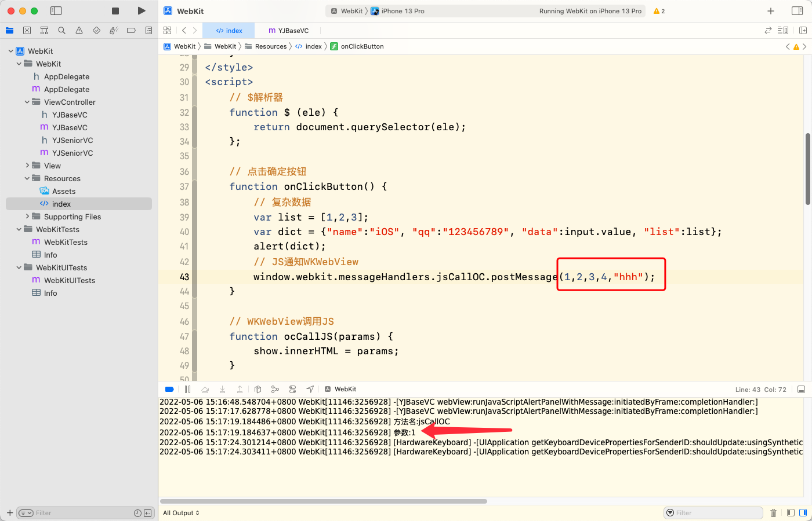
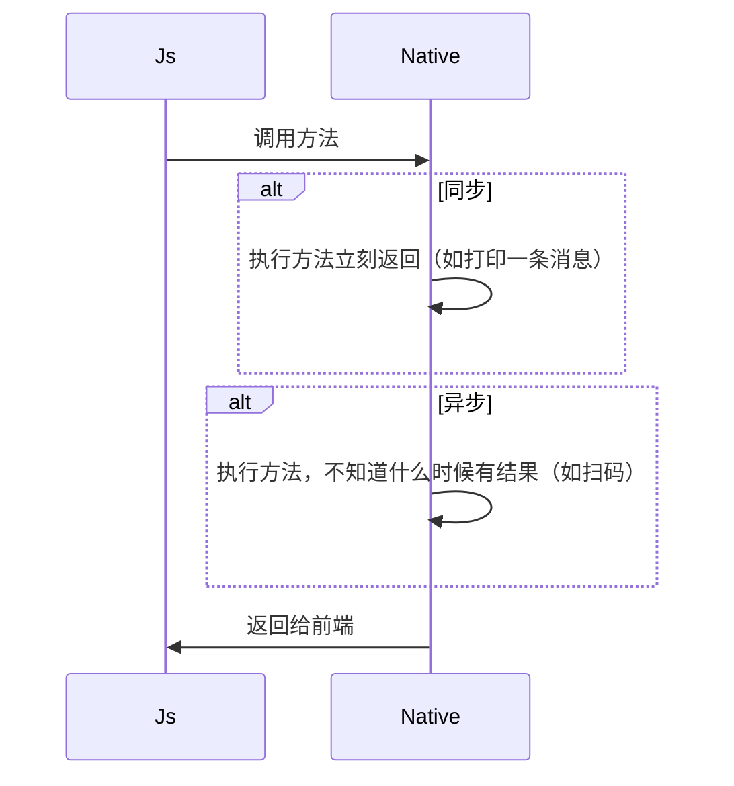

#### JavaScript调用Native的方式，主要有两种：注入API和拦截URL SCHEME。
1. 注入API方式
其主要原理是，通过WebView提供的接口，向JavaScript的Context(window)中注入对象或者方法，让JavaScript调用时，直接执行相应的Native代码逻辑，达到JavaScript调用Native的目的。 
针对Android和iOS有不同的处理方式：
    1. Android的处理方式
    Android中，新建一个类，里面写提供给js操作的方法，并规定**别名**。
    在安卓`4.2`以上可以直接使用`@JavascriptInterface()`注解来声明。
    定义完这个方法后再调用`WebView.addJavascriptInterface()`方法。
    将方法注入到window中，js调用时，根据`window.别名.方法(参数)`来调用。
     
    2. iOS的处理方式
    iOS是利用WKWebView的新特性`MessageHandler`来实现JS调用原生方法的。
    WKWebView初始化时，创建`WKWebViewConfiguration`对象，配置各个接口对应的`MessageHandler`，然后再接受js传递的参数调用接口。
    js调用时，使用`window.webkit.messageHandlers.方法.postMessage(参数/null)`。
 
2. 拦截URL SCHEME
拦截URL SCHEME的主要流程是：Web端通过某种方式（例如iframe.src）发送URL Scheme 请求，之后Native拦截到请求并根据URL SCHEME（包括所带的参数）进行相关操作。 
在这个过程中，这种方式有一定的缺陷：
    + 使用iframe.src发送URL SCHEME会有URL长度的隐患，而且特殊字符需要编码解码。
    + 创建请求，需要一定的耗时，比注入API的方式调用同样的功能，耗时会较长。

------

#### JavaScript调用Android和iOS时入参的区别
1. 无入参时
    + 调用Android：`window.别名.方法()`
    + 调用iOS：`window.webkit.messageHandlers.方法.postMessage(null)`
2. <mark>有入参时（未完成，存疑）</mark>
    + 调用Android：`window.别名.方法(入参A, 入参B, ...args)`
    + 调用iOS：`window.webkit.messageHandlers.方法.postMessage({名称A: 入参A, 名称B: 入参B, ...})`或者`window.webkit.messageHandlers.方法.postMessage([入参A, 入参B, ...args])`。此处需要和iOS同事事先定义好。
    > 注意：入参多个的情况，调用iOS时的传参不可像安卓那样，iOS此时只能接收到第一个入参！
    

------

#### 同步与异步
