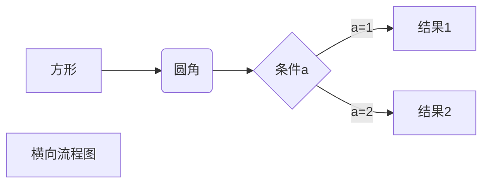
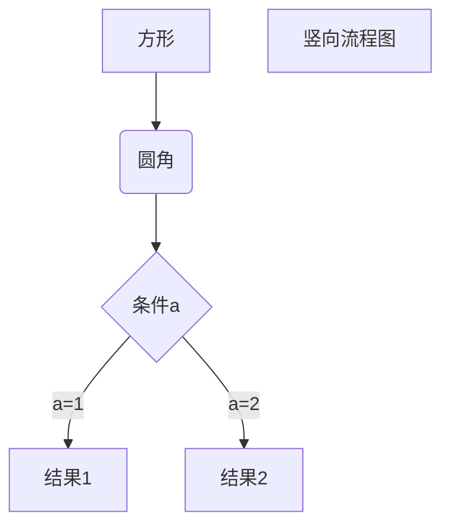
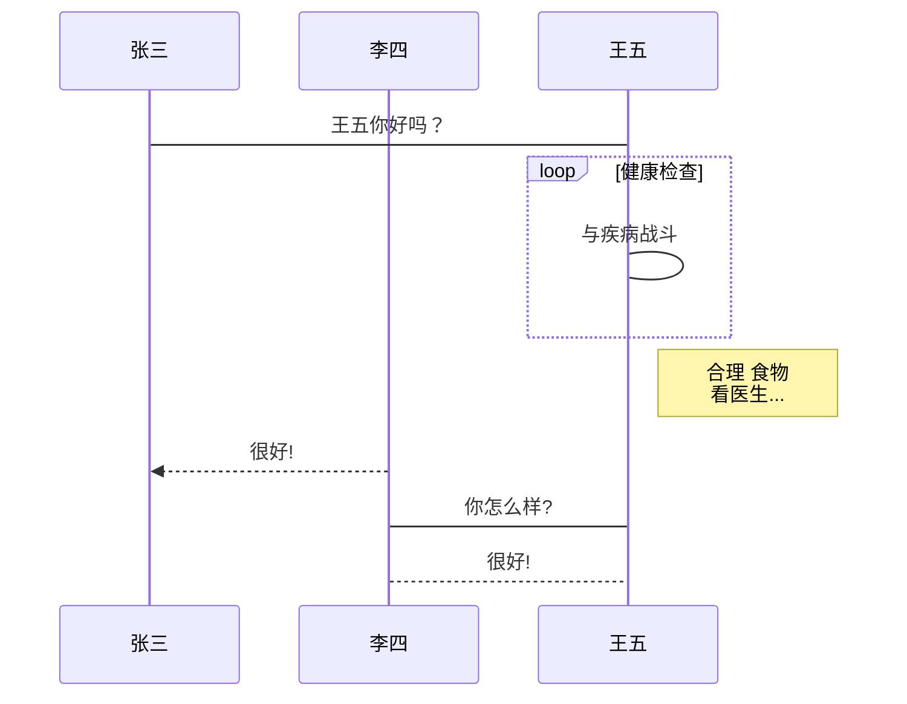

😐😕😃😦😗😒😡✅❎

---------

# 一级标题
## 二级标题
### 三级标题
#### 四级标题
##### 五级标题
###### 六级标题

一级标题
===
二级标题
---

---------

段落一（两个空格+回车）  

段落二（使用空行表示重新开始一个段落）

---------

*斜体文本示例一*
_斜体文本示例二_
<!-- <i>斜体文本示例三<i> -->

**粗体文本示例一**
__粗体文本示例二__
<!-- <b>粗体文本示例三<b> -->

***斜粗体文本示例一***
___斜粗体文本示例二___
<!-- <i><b>斜粗体文本示例三<b><i> -->

---------

分隔线：
***
* * *
*****
- - -
---------


删除线：
~~删除线示例一~~
<del>删除线示例二</del>

---------

下划线：
<u>下划线示例一</u>

---------

脚注（[^要注明的文本]）：
创建脚注格式类似这样[^1]或者这样[^2]
[^1]: 我是脚注内容1
[^2]: 我是脚注内容2

---------

<mark>高亮</mark>

文本<sub>下角<sub>

文本<sup>上角</sup>

<small>小字体</small>

<big>大字体</big>

<tt>打字机文本</tt>

<font face="楷体" color="pink" size="4">字体大小、颜色、字体等信息</font>

<font face="楷体">楷体</font>
<font color="red">red</font>
<font size="5">5</font>

---------

无序列表：
* 第一项
* 第二项

+ 第三项
+ 第四项

- 第五项
- 第六项

---------

有序列表：
1. 第一项
2. 第二项

---------

列表嵌套（只需在子列表中的选项前面添加四个空格即可）：
1. 第一项：
    - 第一项嵌套的第一个元素
    - 第一项嵌套的第二个元素
2. 第二项：
    - 第二项嵌套的第一个元素
    - 第二项嵌套的第二个元素

---------

区块：
> 区块引用
> 内容内容

区块嵌套：
> 第一级
> > 第二级
> > > 第三级
> > > 第三级

区块中使用列表：
> 区块中使用列表
> 1. 第一项
> 2. 第二项
> + 第一项
> + 第二项

列表中使用区块：
1. 第一项
    > 区块内容
2. 第二项
    > 区块内容

---------

代码：
`Hello World`

```javascript
// 指定一种语言或者不指定
$(document).ready(function () {
    alert('RUNOOB');
});
```

    // （使用4个空格或1or2个制表符）
    let str = '内容';
    let arr = [1, 2, 3];

---------

链接：
<a href='https://www.baidu.com/'>百度</a>
[链接名称](链接地址)
[百度](https://www.baidu.com/)
<https://www.baidu.com/>

---------

高级链接：
这个链接用 百度 作为网址变量[百度][百度]
这个链接用 google 作为网址变量 [Google][google]
这个链接用 runoob 作为网址变量 [Runoob][runoob]
<!-- 然后在文档的结尾为变量赋值（网址） -->

[百度]: https://www.baidu.com/
[google]: http://www.google.com/
[runoob]: http://www.runoob.com/

---------

图片：
<!--  -->


像网址那样对图片网址使用变量
这个链接用 img 作为网址变量 [RUNOOB][img].
<!-- 然后在文档的结尾为变量赋值（网址） -->

[img]: http://static.runoob.com/images/runoob-logo.png


---------

表格（使用`|`来分隔不同的单元格，使用`-`来分隔表头和其他行）：
| 姓名 | 性别 |
| - | - |
| 张三 | 男 |
| 李四 | 女 |

设置表格对齐方式（`:-`代表左对齐，`:-:`代表居中对齐，`-:`代表右对齐）
| 左对齐 | 居中对齐 | 右对齐 |
| :- | :-: | -: |
| 单元格内容 | 单元格内容 | 单元格内容 |
| 单元格内容 | 单元格内容 | 单元格内容 |

---------

高级技巧：
1. 支持的HTML元素
不在Markdown涵盖范围之内的标签，都可以直接在文档里面用HTML撰写
目前支持的HTML元素有：`<kbd><b><i><em><sup><sub><br>`等
使用 <kbd>Ctrl</kbd>+<kbd>Alt</kbd>+<kbd>Del</kbd> 重启电脑

2. 转义
如果需要显示特定的符号则需要使用转义字符，Markdown使用反斜杠转义特殊字符
**文本加粗**
\*\* 正常显示星号 \*\*
\\   反斜线
\`   反引号
\*   星号
\_   下划线
\{\}  花括号
\[\]  方括号
\(\)  小括号
\#   井字号
\+   加号
\-   减号
\.   英文句点
\!   感叹号

3. 公式
+ `$...$`或者`\(...\)`中的数学表达式将会在行内显示
+ `$$...$$`或者`\[...\]`或者```math中的数学表达式将会在块内显示
f(x) = sin(x) + 12
$f(x) = sin(x) + 12$
\(f(x) = sin(x) + 12\)
$$
\begin{Bmatrix}
   a & b \\
   c & d
\end{Bmatrix}
$$
$$
\begin{CD}
   A @>a>> B \\
@VbVV @AAcA \\
   C @= D
\end{CD}
$$

---------

1. 横向流程图源码格式


2. 竖向流程图源码格式


3. 标准流程图源码格式
```flow
st=>start: 开始框
op=>operation: 处理框
cond=>condition: 判断框(是或否?)
sub1=>subroutine: 子流程
io=>inputoutput: 输入输出框
e=>end: 结束框
st->op->cond
cond(yes)->io->e
cond(no)->sub1(right)->op
```

4. 标准流程图源码格式（横向）
```flow
st=>start: 开始框
op=>operation: 处理框
cond=>condition: 判断框(是或否?)
sub1=>subroutine: 子流程
io=>inputoutput: 输入输出框
e=>end: 结束框
st(right)->op(right)->cond
cond(yes)->io(bottom)->e
cond(no)->sub1(right)->op
```

5. UML时序图源码样例
```sequence
对象A->对象B: 对象B你好吗?（请求）
Note right of 对象B: 对象B的描述
Note left of 对象A: 对象A的描述(提示)
对象B-->对象A: 我很好(响应)
对象A->对象B: 你真的好吗？
```

6. UML时序图源码复杂样例
```sequence
Title: 标题：复杂使用
对象A->对象B: 对象B你好吗?（请求）
Note right of 对象B: 对象B的描述
Note left of 对象A: 对象A的描述(提示)
对象B-->对象A: 我很好(响应)
对象B->小三: 你好吗
小三-->>对象A: 对象B找我了
对象A->对象B: 你真的好吗？
Note over 小三,对象B: 我们是朋友
participant C
Note right of C: 没人陪我玩
```

7. UML标准时序图样例


8. 甘特图样例
<!-- ```mermaid
%% 语法示例
        gantt
        dateFormat  YYYY-MM-DD
        title 软件开发甘特图
        section 设计
        需求                      :done,    des1, 2014-01-06,2014-01-08
        原型                      :active,  des2, 2014-01-09, 3d
        UI设计                     :         des3, after des2, 5d
    未来任务                     :         des4, after des3, 5d
        section 开发
        学习准备理解需求                      :crit, done, 2014-01-06,24h
        设计框架                             :crit, done, after des2, 2d
        开发                                 :crit, active, 3d
        未来任务                              :crit, 5d
        耍                                   :2d
        section 测试
        功能测试                              :active, a1, after des3, 3d
        压力测试                               :after a1  , 20h
        测试报告                               : 48h
``` -->
